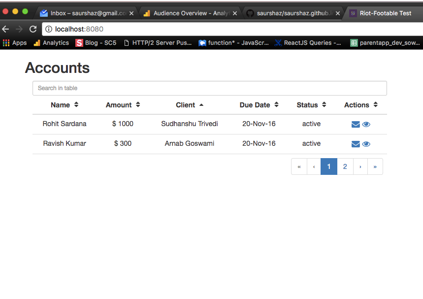

# riot-fast-tables
riot fast tables component created with Riot.

## About
- This uses [footable](https://github.com/fooplugins/FooTable)
- This component was written to provide a base to build quick table views using Riot. 

This will enable churning out good looking tabular views.

## Install and run locally
1. Clone the repository
2. "npm install"
3. "npm start"
4. Open [http://localhost:8080](http://localhost:8080)
5. (Make changes.)
6. (Refresh browser.)
7. (Repeat steps 5-7.)

## Screenshot

## License
Everything in this repo is MIT License unless otherwise specified.
